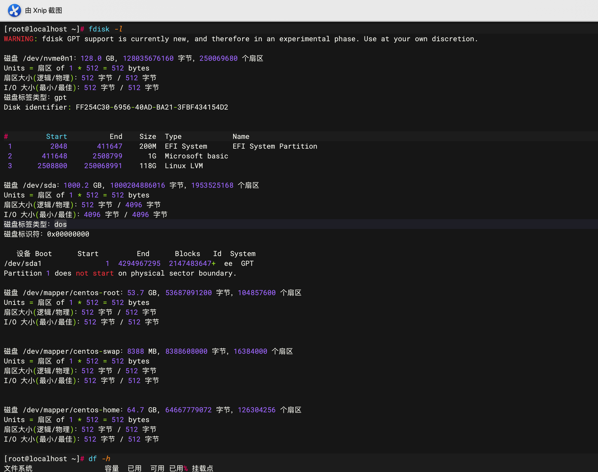
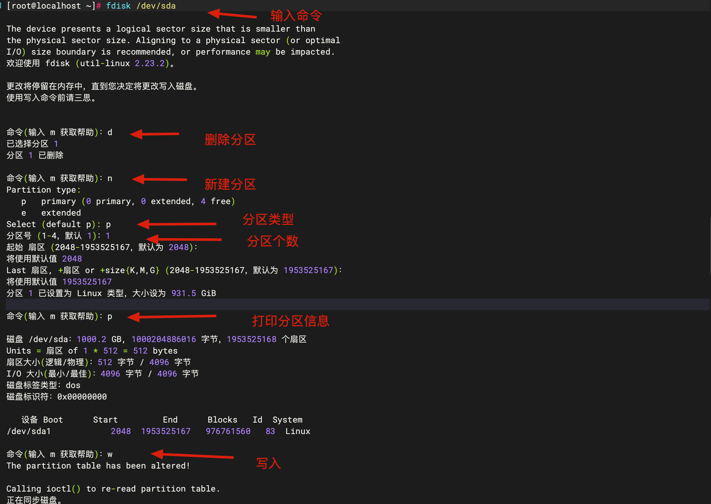
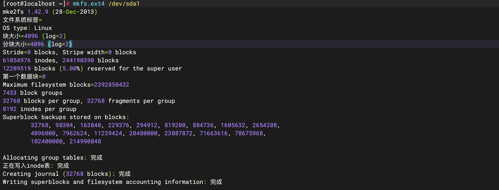
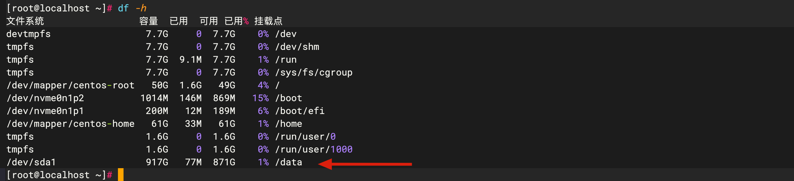

> 笔记本安装 centos7 系统;笔记本本身有两块硬盘,120G 固态和 1T 机械;
>
> 固态上安装系统,机械作为第二块硬盘存储文件

* sudo fdisk -l 

> 查看所有硬盘和分区

> 磁盘 /dev/nvme0n1：系统盘
>
> 磁盘 /dev/sda：第二块硬盘
>
> > 下面存在分区: /dev/sda1 ; 
> >
> > 并且存在问题:Partition 1 does not start on physical sector boundary.(分区1不是从物理扇区的边界开始的)

* fdisk /dev/sda

* mkfs.ext4 /dev/sda1 

> 创建分区

* 挂载分区

  * mkdir /data
  * mount /dev/sda1 /data

  > 将sda这个硬盘分区 sda1挂载到/data目录

  * echo "/dev/sda1 /data ext4 defaults 0 0" >> /etc/fstab

  > 配置系统开启自动挂载。

最后查看下是否成功:

